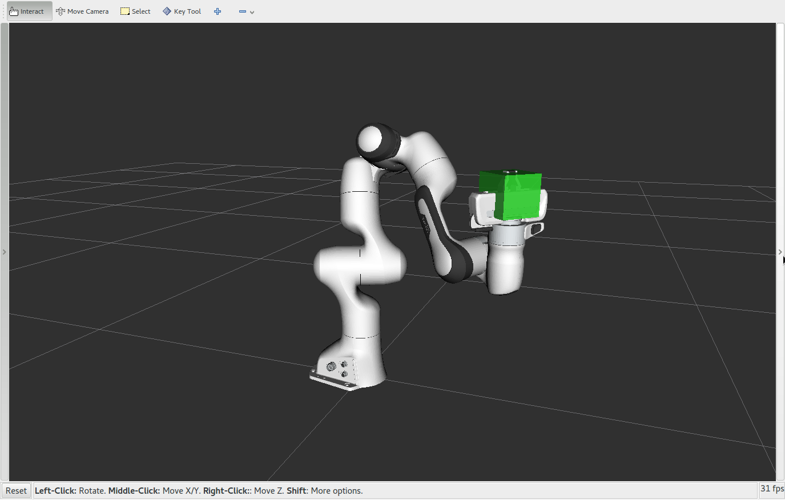

Move Group Python インタフェース
================================================

MoveItのユーザーインタフェースの利用する際の最も簡単な方法は，Pythonから"Move Group"インタフェースを使用する方法です．これらのラッパーは目標関節角度や目標姿勢の設定，動作計画，ロボットへの動作司令，環境への物体の追加，そしてロボットへの物体の取り付け/取り外し等，一般的なユーザーに必要となるほとんどの機能を提供します．

こちらの動画 `YouTube video demo <https://youtu.be/3MA5ebXPLsc>`_ を観て，Move Group Python インタフェースで何ができるか確認しましょう!

はじめに
---------------
もしまだ `はじめに <../getting_started/getting_started.html>`_ を済ましていなければ，まずはそちらから始めてください．

RViz と MoveGroup ノードの起動
-----------------------------------------------------------------
Shellを２つ立ち上げ，一方はRVizを起動しすべて完了するまで待ちます: ::

  roslaunch panda_moveit_config demo.launch

もう一方のshellでは，``rosrun`` を用いてPythonコードを直接走らせます. ::

 rosrun moveit_tutorials move_group_python_interface_tutorial.py

Note : 環境によってはPythonスクリプトへ実行権限を追加する必要があります．

今回のゴール
---------------
RViz上で, 下記のことができているか確認します:

一つ前の章の ``rosrun`` を走らせたターミナルのshellで *<enter>* を押して，下記の各々のステップに進んでください．
 #. ロボットの腕の動きが計画されており，目標関節角度まで移動すること
 #. ロボットの目標姿勢までの経路が計画されていること
 #. ロボットが直動軌道で計画されていること
 #. ロボットが再度直動軌道で計画されていること
 #. ロボットがその直動軌道で実行されていること
 #. Pandaのエンドエフェクタの位置に立方体が構築されていること
 #. 立方体が取り付けられていることを示すために，その色が変わっていること
 #. 立方体が取り付けられたロボットが直動軌道で計画/実行されていること
 #. 立方体が取り外されたことを示すために，色が変わっていること
 #. 立方体が消えていること

Pythonコードの中身
----------------------------------------------
Note: 今回のpythonコードはまとめて :codedir:`チュートリアルのGitHubレポジトリ<move_group_python_interface/scripts/move_group_python_interface_tutorial.py>` で見られます．

.. tutorial-formatter:: ./scripts/move_group_python_interface_tutorial.py

Launch ファイル
---------------
すべてのLaunchファイルはGitHub上の :codedir:`ここ<move_group_python_interface/launch/move_group_python_interface_tutorial.launch>`
から確認できます．また，本チュートリアルに記載されているすべてのソースコードは，MoveItのセットアップ時にダウンロードしてきた
``moveit_tutorials`` パッケージに格納されているものを実行しています．
