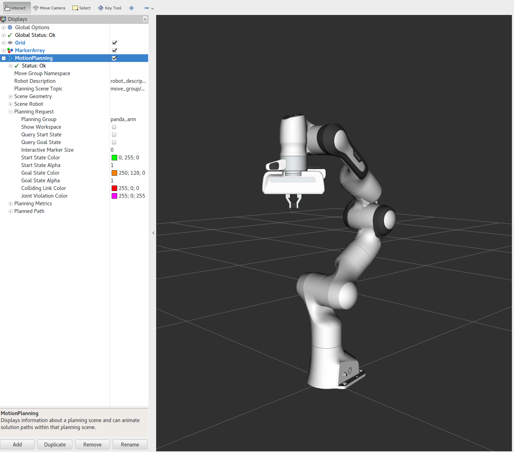

MoveIt Commanderスクリプト
===========================

`moveit_commander <http://wiki.ros.org/moveit_commander>`_ PythonパッケージはMoveItで提供されている機能をラッパーにして提供してくれます．シンプルなインタフェースは動作計画や直動動作の算出，物体を拾ったり置いたりすることを可能にしてくれます． ``moveit_commander`` パッケージにはコマンドライン・インタフェースである ``moveit_commander_cmdline.py`` も含まれています．

はじめに
---------------
もしまだ済ましていなければ，まず `はじめに <../getting_started/getting_started.html>`_ から始めてください.

RVizとコマンドラインツールを立ち上げる
----------------------------------------------------------------
まずshellを２つ立ち上げ，一方はRVizを起動しすべて完了するまで待ちます: ::

  roslaunch panda_moveit_config demo.launch

次に ``moveit_commander`` インタフェースをもう一つのshellで初期化します: ::

 rosrun moveit_commander moveit_commander_cmdline.py

MoveIt Commanderコマンドラインツールを使う
-------------------------------------------------------------------------
下記コマンドで `move_group` ノードを初期化し，アクセス可能になるコマンドラインツールが立ち上がります．早速入力してみましょう: ::

 use <group name>

このコマンドにより `move_group` ノードとあなた自身が決めた名前のグループをつなげます（Pandaロボットでは， ``panda_arm`` とつながります）. これで指定したグループのコマンドを実行することができるようになります．下記の ``current`` コマンドにより， グループの現在の状態を表示できます: ::

 current

下記のように自分で決めた名前（今回は ``c`` ）にロボットの状態を記録することができます: ::

 rec c

このコマンドにより ``c`` という変数にロボットの現在の関節角を記録します．これにより，Matlabのような記法で関節角を変更することもできます． ここでは， ``goal`` という変数に先程関節角を記録した ``c`` をコピーします．その後， ``goal`` の一番目の関節の値を ``0.2`` に変更します． ``0.2`` 以外の値を設定することもできます．（ただし，限界関節角度内もしくは，非衝突範囲内に設定する必要があります）．最後に ``go`` コマンドで動作計画と実行を行います．

ロボットを動かすために，例えば下記のように入力することができます: ::

 goal = c
 goal[0] = 0.2
 go goal

また ``go`` を呼び出す代わりに，このように入力することもできます: ::

 goal[0] = 0.2
 goal[1] = 0.2
 plan goal
 execute

``go`` よりも記述は多いですが, ``plan`` コマンドは実行する前にRViz上で計画を表示してくれるという点で優れています．

コマンドの参照をするには， ``help`` と入力してください．また， ``moveit_commander`` インタフェースを終了するには， ``quit`` と入力してください.
