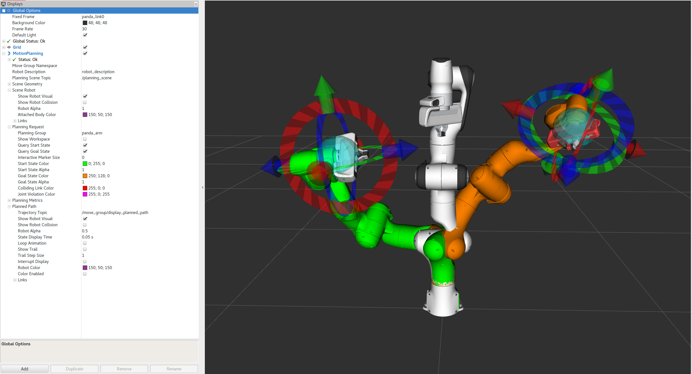

MoveItクイックスタート with RViz
================================

本チュートリアルではRVizやMoveItプラグインを使い，MoveItで簡単にモーションプランニングを行えるようにします．RVizとはROSの標準的なビジュアライザであり，ロボットのデバッグにとても便利なツールです．MoveItのRVizプラグインでは，仮想環境（シーン）のセットアップや，開始，終了姿勢のインタラクティブな生成，様々なプランナのテストと結果の表示までできます．早速始めましょう！
           

はじめに
---------------
まだ `はじめに <../getting_started/getting_started.html>`_ を終わらせていない方は，先にそちらをご覧ください．

Step 1: デモの起動とプラグインの設定
------------------------------------------------

* デモの起動 ::

   roslaunch panda_moveit_config demo.launch rviz_tutorial:=true

* 初めて起動する場合，何も表示されていないRVizが起動するので，"Motion Planning Plugin" を追加する必要があります．

  * 何も表示されていないRViz．

  |A|

  * "Display"タブより，"Add" ボタンを押下．

  |B|

  * "moveit_ros_visualization" フォルダより"MotionPlanning"を選択し，"OK"ボタンを押下．

  |C|

  * 成功すれば，RVizに Panda ロボットが表示されます．

  |D|

.. |B| image:: rviz_click_add.png
               :width: 405px

* "Motion Planning Plugin"がロードできれば，設定を行うことができます．．"Global Options"タブ内の"Display"ウィンドウ内にある "**Fixed Frame**"に ``/panda_link0`` と入力してください．

* これで，ロボット（ここでは Panda）のプラグインの設定を始める事ができます．"Displays"内の"MotionPlanning"をクリックしてみてください．

  * "**Robot Description**"の設定内容が ``robot_description`` になっていることを確認してください．

  * "**Planning Scene Topic**"の設定内容が ``/planning_scene`` になっていることを確認してください．
    "topic name"をクリックすると，トピック名がドロップダウンに出てきます．

  * "**Planning Request**"内の，"**Planning Group**"を ``panda_arm`` に設定してください．

  * "**Planned Path**"内の，"**Trajectory Topic**"を ``/move_group/display_planned_path`` に設定してください．

Step 2: ロボットの表示を色々変えてみる
-----------------------------------------
ロボットは下記の4つが重なって表示されています．

#. プランニング環境 ``/planning scene`` に設定されているロボットの設定（デフォルトで有効）．

#. ロボットのプランニング軌道（デフォルトで有効）．

#. 緑：モーションプランニングの開始姿勢（デフォルトで無効）．

#. 橙：モーションプランニングの目標姿勢（デフォルトで有効）．

これらの表示，非表示は下記チェックボックスで切り替えが可能です．

#. プランニング環境に設定されているロボット（シーンロボット）は"**Scene Robot**"タブ内の"**Show Robot Visual**"チェックボックスから切り替えが可能．

#. プランニング軌道は"**Planned Path**"タブ内の"**Show Robot Visual**"チェックボックスから切り替えが可能．

#. 開始姿勢は"**Planning Request**"タブ内の"**Query Start State**"チェックボックスから切り替えが可能．

#. 終了姿勢は"**Planning Request**"タブ内の"**Query Goal State**"チェックボックスから切り替えが可能．

* 各チェックボックスを色々切り替えて表示の変化を確認してみましょう！

.. image:: rviz_plugin_visualize_robots.png
   :width: 700px

Step 3: Pandaを動かしてみる
-------------------------------
次のステップでは，シーンロボット，開始姿勢，目標姿勢のみを使用します．

#. "**Planned Path**"タブの"**Show Robot Visual**"を有効にしてください．

#. "**Scene Robot**"タブの"**Show Robot Visual**"を無効にしてください．

#. "**Planning Request**"タブの"**Query Goal State**"を有効にしてください．

#. "**Planning Request**"タブの"**Query Start State**"を有効にしてください．

ここまで完了すると，2つのインタラクティブマーカが出ているはずです．オレンジ色のアームの周りに出ているマーカは"Goal State"（目標姿勢）を設定するのに使用し，もう一方の緑のアームの周りに出ているマーカは"Start State"（開始姿勢）を設定するのに使用します．もしこれらのインタラクティブマーカが表示されていない場合には，RVizのトップメニュー内にある"**Interact**"を押下してください．（Note：ツールが隠れて見えない場合には，下図の"**Interact**"ボタンの右横に見える **"+"** ボタンを押して "**Interact**" ツールを表示させてください．）

これでマーカをドラッグしてアームを動かし，好きな姿勢に設定できるようになりました．いろいろと動かして遊んでみましょう！

衝突位置まで動かす
+++++++++++++++++++++
アームが衝突範囲に入った場合どうなるか確認してみましょう．下図のように２つの衝突しているリンクが赤くなるはずです．

.. image:: rviz_plugin_collision.png
   :width: 700px

"Planning"タブ下の"MotionPlanning"プラグインに表示されている"Use Collision-Aware IK"チェックボックスにより，IK（Inverce Kinematics，逆運動学）ソルバの設定を変えることができます．チェックボックスを有効にした場合，ソルバはエンドエフェクタの姿勢に合わせ，非衝突な姿勢を算出します．一方チェックボックスを無効にした場合，ソルバは衝突，非衝突を考慮することなく計算を行います．なお，このチェックボックスをどちらに設定しても，衝突しているリンクは赤色で表示されます．

到達不可能な領域に動かす場合
+++++++++++++++++++++++++++++++++
エンドエフェクタをアームが到達不可能な領域まで動かした場合どうなるか確認しておきましょう．下図のようにアームが追従しなくなるはずです．

.. image:: rviz_plugin_invalid.png
   :width: 700px

Step 4: Pandaでモーションプランニングを行う
---------------------------------------------------

* MoveIt RVizプラグインを使ってPandaのモーションプランニングを行いましょう！

  * 開始姿勢を任意の姿勢に設定してください．

  * 目標姿勢を他の任意の姿勢に設定してください．

  * 開始姿勢，目標姿勢のどちらともが自己干渉していないことを確認してください．

  * 生成する軌道を表示するために，"**Planned Path**"タブ内の"**Show Trail**"チェックボックスを有効にしてください．

* "**Planning**"タブ下の"**MotionPlanning**"ウィンドウにある"**Plan**"ボタンを押下してください．うまくいけば生成した軌道が表示されるはずです．

生成軌道の軌跡を確認する
++++++++++++++++++++++++++++++++++
RVizから生成した軌道の軌跡を確認することができます．

* "`Panels`" メニューから，"`MotionPlanning - Slider`"を選択すると，RViz上にスライダパネルが表示されます．

* 目標姿勢を設定し， `Plan` を行ってください．

* スライダを動かした後"`Play`"ボタンを押してみるなどして，"`Slider`"パネルの挙動を確認してみましょう．

.. note:: 一度エンドエフェクタを新しい目標姿勢まで動かした場合は， `Play` を行う前に， `Plan` を行うのを忘れないでください．これを行わなかった場合，新しい目標姿勢までの軌道ではなく，前回プランニングした際の軌道が表示されることになります．

次のステップ
--------------

RViz表示ツール
+++++++++++++++++
多くのチュートリアルで ``moveit_visual_tools`` を利用しています．次のチュートリアルへ移る前に "**RvizVisualToolsGui**"を有効にすることをおすすめします．

"`Panels`"メニューから"`RvizVisualToolsGui`"を選択してください．すると下図のようにRVizに新しいパネルが追加されるはずです．

.. image:: rviz_pannels.png
   :width: 700px

設定情報を保存する
+++++++++++++++++++++++++
RVizでは ``File->Save Config`` から，設定ファイルを保存することができます．次のチュートリアルに移る前に設定を保存しておくことをおすすめします．

次のチュートリアル
++++++++++++++++++++
* C++からロボットを操作したい場合は， `Move Group C++ インタフェース <../move_group_interface/move_group_interface_tutorial.html>`_ を確認してください．

* Pythonからロボットを操作したい場合は， `Move Group Python インタフェース <../move_group_python_interface/move_group_python_interface_tutorial.html>`_ を確認してください．

* オリジナルのロボットで ``*_moveit_config`` パッケージを作りたい場合には， `セットアップアシスタント <../setup_assistant/setup_assistant_tutorial.html>`_ を確認してください．
