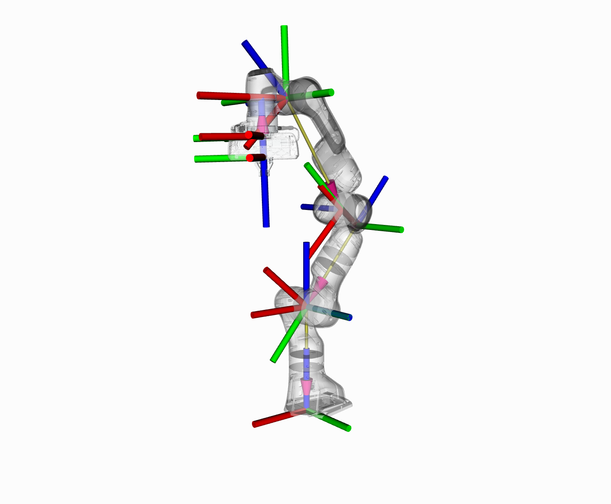

ロボットモデルとその状態
=====================================================

この章ではMoveItで運動学を扱うため，C++ APIで行います．

RobotModelとRobotStateクラス
-------------------------------------
:moveit_core:`RobotModel` と :moveit_core:`RobotState` クラスはロボットの運動学を扱うために必要不可欠なクラスです．

:moveit_core:`RobotModel` クラスには，URDFから得た関節の限界値も含めたすべてのリンクと関節の関係性が含まれています． :moveit_core:`RobotModel` クラスは，ロボットのリンクと関節をSRDFに従ってそれぞれのplanning groupに分けることもします．URDFとSRDFについては，別のチュートリアルの `URDF and SRDF Tutorial <../urdf_srdf/urdf_srdf_tutorial.html>`_ をご覧ください．

:moveit_core:`RobotState` クラスは，ロボットのその瞬間の情報を有しています．それらの情報には，関節位置のベクトルやエンドエフェクタのヤコビアンのようにロボットの運動情報を取得するのに必要となる速度や加速度が含まれています．

:moveit_core:`RobotState` クラスには，エンドエフェクタの位置（直行姿勢）に合わせたロボットの腕の位置を決める時や直動軌道を計算する時に役立つ関数を有しています．

今回の例では，Pandaロボットにこれらのクラスを用いてチュートリアルを行っていきます．

はじめに
---------------
もしまだ済ましていなければ，まず `はじめに <../getting_started/getting_started.html>`_ から始めてください．

コードを走らせる
----------------------------------------
チュートリアルで用いられたすべてのコードは，MoveIt setupにある ``moveit_tutorials`` パッケージからコンパイルと実行を行うことができます．

Roslaunchを用いることで，直接 ``moveit_tutorials`` からlaunchファイルのコードを走らせることができます: ::

 roslaunch moveit_tutorials robot_model_and_robot_state_tutorial.launch

今回のゴール
---------------------------------
本チュートリアルでは，以下の形式で出力できることが目標です．ランダムな関節角を用いるため，数字が一致しなくても大丈夫です: ::

 ros.moveit_tutorials: Model frame: /panda_link0
 ros.moveit_tutorials: Joint panda_joint1: 0.000000
 ros.moveit_tutorials: Joint panda_joint2: 0.000000
 ros.moveit_tutorials: Joint panda_joint3: 0.000000
 ros.moveit_tutorials: Joint panda_joint4: 0.000000
 ros.moveit_tutorials: Joint panda_joint5: 0.000000
 ros.moveit_tutorials: Joint panda_joint6: 0.000000
 ros.moveit_tutorials: Joint panda_joint7: 0.000000
 ros.moveit_tutorials: Current state is not valid
 ros.moveit_tutorials: Current state is valid
 ros.moveit_tutorials: Translation:
 -0.541498
 -0.592805
  0.400443

 ros.moveit_tutorials: Rotation:
 -0.395039  0.600666 -0.695086
  0.299981 -0.630807 -0.715607
 -0.868306 -0.491205 0.0690048

 ros.moveit_tutorials: Joint panda_joint1: -2.407308
 ros.moveit_tutorials: Joint panda_joint2: 1.555370
 ros.moveit_tutorials: Joint panda_joint3: -2.102171
 ros.moveit_tutorials: Joint panda_joint4: -0.011156
 ros.moveit_tutorials: Joint panda_joint5: 1.100545
 ros.moveit_tutorials: Joint panda_joint6: 3.230793
 ros.moveit_tutorials: Joint panda_joint7: -2.651568
 ros.moveit_tutorials: Jacobian:
     0.592805   -0.0500638    -0.036041     0.366761   -0.0334361     0.128712 -4.33681e-18
    -0.541498   -0.0451907    0.0417049    -0.231187    0.0403683   0.00288573  3.46945e-18
            0    -0.799172    0.0772022    -0.247151    0.0818336    0.0511662            0
            0     0.670056    -0.742222     0.349402    -0.748556    -0.344057    -0.695086
            0     -0.74231    -0.669976    -0.367232    -0.662737     0.415389    -0.715607
            1  4.89669e-12    0.0154256     0.862009     0.021077     0.842067    0.0690048

**Note:** ROSコンソールの出力形式が異なっていても安心してください．もし同じような形式にしたければ， `こちら <http://dav.ee/blog/notes/archives/898>`_ をご覧ください．

コードの中身
-------------------------
コードの中身は :codedir:`the MoveIt GitHub project<robot_model_and_robot_state/src/robot_model_and_robot_state_tutorial.cpp>` で見ることができます．

.. tutorial-formatter:: ./src/robot_model_and_robot_state_tutorial.cpp

Launchファイル
^^^^^^^^^^^^^^^^^^^^^^^^^^^^
コードを走らせるのに，以下の２つのことを行うlaunchファイルが必要です:
 * PandaロボットのURDFとSRDFをパラメータサーバに渡すこと，また
 * MoveIt Setup Assistantにより出来た ``kinematics_solver`` コンフィグレーションを本チュートリアルでインスタンス化されたノードの `namespace` にあるROSパラメータサーバに渡すこと.

.. literalinclude:: ./launch/robot_model_and_robot_state_tutorial.launch

ロボットの状態をデバッグする
------------------------------------------
コマンドラインツールは，ロボットの状態をデバッグする際のシステムの足りない部分を補ってくれます: ::

  rosrun moveit_ros_planning moveit_print_planning_model_info
